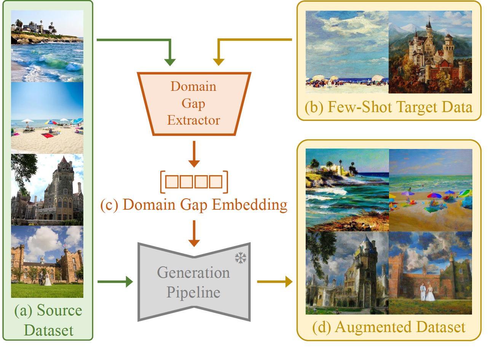
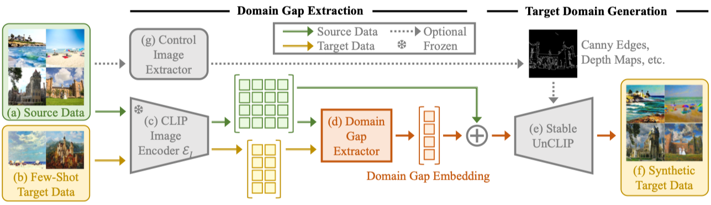
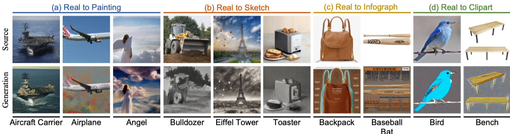

# Domain Gap Embeddings for Generative Dataset Augmentation (CVPR 2024)

## Overview
<p align="center"></p>

> **Yinong Oliver Wang<sup>\*</sup>, Younjoon Chung<sup>\*</sup>, Chen Henry Wu, Fernando De La Torre<br>**
> Carnegie Mellon University &nbsp;*Equal contribution <br>
> CVPR 2024
>
>The performance of deep learning models is intrinsically tied to the quality, volume, and relevance of their training data. Gathering ample data for production scenarios often demands significant time and resources. Among various strategies, data augmentation circumvents exhaustive data collection by generating new data points from existing ones. However, traditional augmentation techniques can be less effective amidst a shift in training and testing distributions. This paper explores the potential of synthetic data by leveraging large pre-trained models for data augmentation, especially when confronted with distribution shifts. Although recent advancements in generative models have enabled several prior works in cross-distribution data generation, they require model fine-tuning and a complex setup. To bypass these shortcomings, we introduce Domain Gap Embeddings (DoGE), a plug-and-play semantic data augmentation framework in a cross-distribution few-shot setting. Our method extracts disparities between source and desired data distributions in a latent form, and subsequently steers a generative process to supplement the training set with endless diverse synthetic samples. Our evaluations, conducted on a subpopulation shift and three domain adaptation scenarios under a few-shot paradigm, reveal that our versatile method improves performance across tasks without needing hands-on intervention or intricate fine-tuning. DoGE paves the way to effortlessly generate realistic, controllable synthetic datasets following the test distributions, bolstering real-world efficacy for downstream task models.

This is an official PyTorch Implementation of **"Domain Gap Embeddings for Generative Dataset Augmentation"**. 

## Environment setup
The code has been tested with the following setup.

- PyTorch 2.3.0
- CUDA 12.1

```bash
conda env create --name doge --file=environment.yaml
```

## Data Preparation

We provide a link to the DomainNet dataset. Custom dataset should follow a similar data structure.  

|   Dataset    |      Description      |                                              Link                                        |
|:------------:|:---------------------:|:------------------------------------------------------------------------------------------:|
|  [DomainNet](https://mmlab.ie.cuhk.edu.hk/projects/CelebA.html)  |  Common objects in six different domains  |  [Link](https://ai.bu.edu/M3SDA/)  | 


Save the `.zip` files and unzip the downloaded images under ```data/``` directory:
```angular2html
|-- data
|   |-- domainnet
|   |   |-- real
|   |   |   |-- aircraft_carrier
|   |   |   |-- airplane
|   |   |   |-- ...
|   |   |-- painting
|   |   |-- ...
```

## Usage
<!-- <p align="center"></p> -->

1. Extract Domain Gap Embeddings (DoGE) from the reference images.
```bash
python extract_domain_gap.py --src_dir="data/domainnet/real" --tgt_dir="data/domainnet/painting" --src_limit=20 --tgt_limit=20 --save_path="./outputs/emb/doge.pt" --mode="mean" --clip_model_name="stabilityai/stable-diffusion-2-1-unclip" --device="cuda:0"
```

2. Generation on the DomainNet dataset. Below converts the given source images (real) into the painting domain using the computed domain gap.
<p align="center"></p>

```bash 
python generate.py --seed=42 --domain_emb_loc="outputs/emb/doge.pt" --gen_src_dir="data/domainnet/real/angel" --save_dir="outputs/domainnet/angel" --edit_weight=1.5 --n_batch=10 --n_per_prompt=1 --num_inference_steps=20 --save_grid --device="cuda:0" --neg_prompt "blurry, blurred, ambiguous, blending, opaque, translucent, layering, shading, mixing, ugly, tiling, poorly drawn face, out of frame, mutation, disfigured, deformed, blurry, bad art, bad anatomy, text, watermark, grainy, underexposed, unreal architecture, unreal sky, weird colors" --guidance_scale=5.0 --control_type="canny" --controlnet_conditioning_scale=1.0 --canny_lo_thres=100 --canny_hi_thres=800
```

## Reference
If you find this repository helpful, please cite it as
```bibtex
@inproceedings{doge2024,
  title={Domain Gap Embeddings for Generative Dataset Augmentation},
  author={Yinong Oliver Wang, Younjoon Chung, Chen Henry Wu and Fernando De la Torre},
  booktitle={CVPR},
  year={2024},
} 
```